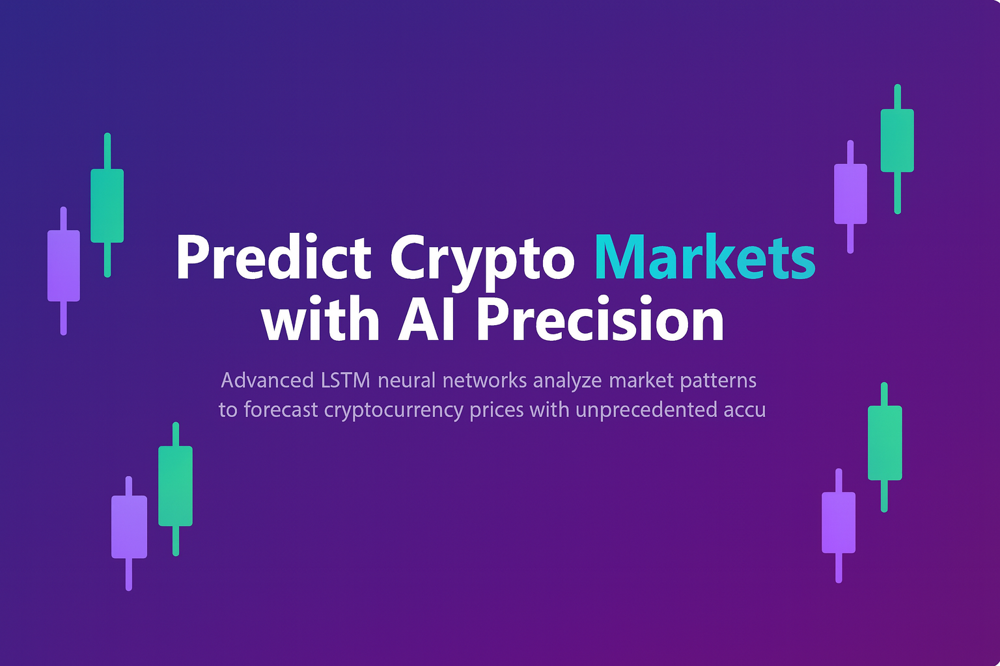

  

<h1 align="center">🚀 Crypto LSTM Price Prediction Platform</h1>

  <b><i>AI-powered deep learning system for real-time cryptocurrency forecasting</i></b>

  
  
  
  
  
  
  

---

## 🧠 Overview

A full-stack, ML-driven platform that predicts cryptocurrency prices using **LSTM neural networks**, real historical market data, and advanced technical indicators — presented through a **modern trading-style UI** with live charts, confidence scores, and model performance metrics.

This project is designed as a **production-style final year / portfolio project** showing:

- Real ML backend (not fake random predictions)  
- Proper data pipeline (market data → indicators → LSTM → metrics)  
- Clean frontend UX with dashboards, charts and dark mode  
- Cloud-native architecture (Supabase + Edge Functions + separate LSTM backend)

---

## ✨ Key Features

- 🔮 **Real LSTM predictions** on cryptocurrency prices  
- 📊 **Technical Indicator Engine**: SMA, EMA, RSI, MACD, Bollinger Bands, ATR  
- 📈 **Model Metrics**: RMSE, MAE, MAPE, Directional Accuracy  
- ⚡ **Fast inference** with model reuse & auto-training on demand  
- 💾 **Model persistence** & scheduled retraining on fresh data  
- 🌍 **Live crypto market data & OHLCV candles**  
- 🧠 **AI-style reasoning text** explaining why the prediction looks bullish/bearish  
- 🌓 **Trading-dashboard UI** with Dark / Light theme, cards & motion  
- 🔐 **Supabase Edge Functions** as a secure bridge to the ML backend  
- 📦 **Docker-ready backend** for easy hosting on Render or other platforms  

---

## 🛠 Tech Stack

| Layer              | Tools / Technologies                                                                 |
|--------------------|--------------------------------------------------------------------------------------|
| **Frontend**       | React, TypeScript, Vite, Tailwind CSS, shadcn-ui, Recharts                          |
| **Backend (ML)**   | FastAPI, Python, TensorFlow, Scikit-Learn, NumPy, Pandas                            |
| **Data & Infra**   | Supabase (PostgreSQL, Edge Functions, Auth), REST APIs                              |
| **Deployment**     | Vercel (frontend), Render (backend), Docker                                         |
| **Others**         | GitHub, CI-ready structure, modular codebase                                        |

---

## 🧩 Project Structure

/frontend     → React UI (Vite + TS + Tailwind + Recharts + shadcn-ui)  
/backend      → FastAPI ML API (TensorFlow LSTM + metrics + model registry)  
/supabase     → Edge functions + SQL migrations + Supabase configuration  

## 🧠 High-Level Architecture
[ React Frontend ]  
       │  
       ▼  
[ Supabase Edge Function ]  ← securely calls ML backend  
       │  
       ▼  
[ FastAPI LSTM Backend ]  ← TensorFlow/Keras, indicators, metrics  
       │  
       ▼  
[ Supabase Postgres ]  
  - OHLCV historical data
  - Technical indicators
  - Models + predictions

The frontend never talks to the ML server directly — it always goes through Supabase Edge Functions, which:  
Validate and enrich requests  
Call the LSTM backend  
Store & fetch predictions from Supabase  

---

## 📊 What the App Shows

Live market cards with price, 24h change, volume, high/low, etc.  
Interactive charts for each coin with:  
 - Price history
 - Technical indicators overlay
 - Prediction overlays  
Prediction panel with:  
 - Predicted price
 - Confidence level (%)
 - Model info (version, last trained, accuracy metrics)
 - Reasoning summary text

---

## 🖼 UI / Screenshots (Placeholders)

Once deployed, add screenshots here:

---

## 🔌 Core API Concepts

LSTM Backend (FastAPI) – example endpoints:  
- GET  /            → Health check  
- POST /predict     → Run LSTM prediction for a symbol  
- POST /train/{symbol}  → Train / retrain model for a specific coin  
- GET  /models      → List trained models and their metrics  

The backend:  
- Loads / trains LSTM models  
- Computes technical features  
- Logs predictions + metrics into Supabase  

---

## 🧮 Model & Metrics

The system tracks:
- RMSE – Root Mean Square Error
- MAE – Mean Absolute Error
- MAPE – Mean Absolute Percentage Error
- Directional Accuracy – % of times the model got the direction correct
These are surfaced in the UI so users can see how reliable the model is.

---

## 📦 Developer Notes

This section is mainly for developers who want to run or redeploy the system.

 
<strong>⚙️ Local Development (Frontend + Backend)</strong>

Frontend
cd frontend
npm install
npm run dev

Backend
cd backend
pip install -r requirements.txt
uvicorn main:app --host 0.0.0.0 --port 8000

 
 
<strong>☁️ Deployment Concept (Vercel + Render + Supabase)</strong>

Frontend → Vercel (build with npm run build)  
Backend → Render (using the provided Dockerfile in /backend)  
Supabase Edge Function:  
Calls the backend URL (e.g. https://your-backend.onrender.com/predict)  
Uses Supabase secrets like:  
SUPABASE_URL  
SUPABASE_SERVICE_ROLE_KEY  
LSTM_BACKEND_URL  
This keeps the architecture modular, secure, and cloud-native.  

---

## 🚀 Future Enhancements

- 📰 NLP Sentiment Analysis (Twitter / Reddit)
- 🧠 Ensemble models (LSTM vs GRU vs classical ML)
- 📈 Portfolio-level prediction & risk analytics
- 🔔 Real-time alerts via WebSocket / push notifications
- 🤖 Strategy backtesting & auto-trade signals

---

## 📜 License

This project is released under the MIT License.

---

## ⭐ Support

If you find this project useful, interesting, or helpful for learning:

👉 Please star ⭐ the repository

---